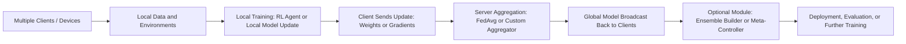
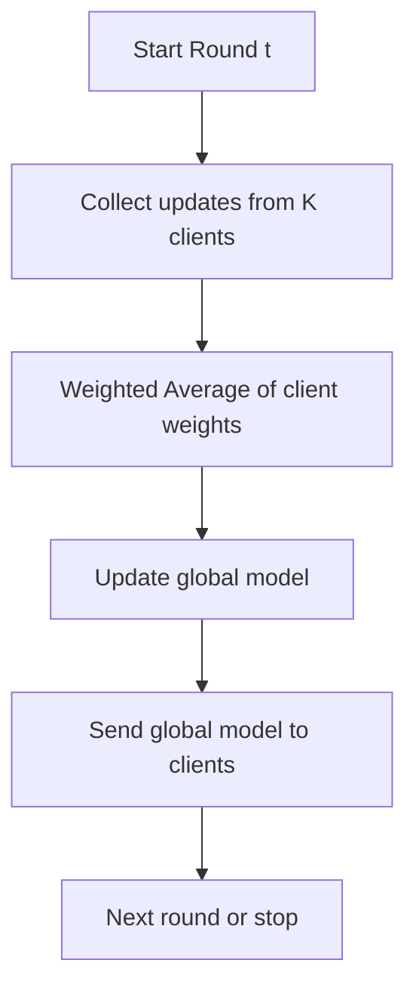
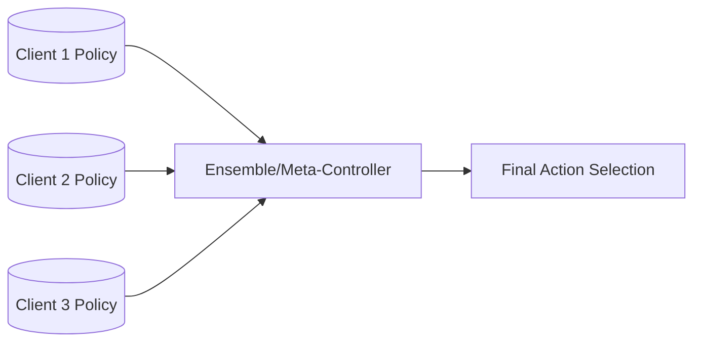
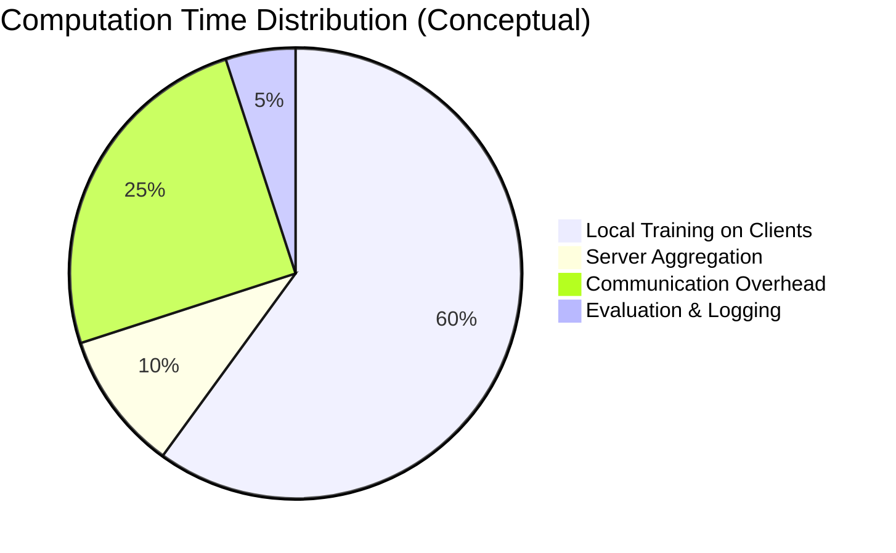

# RL + Federated Learning Ensemble — Beginner’s Guide

A comprehensive, self-contained Markdown guide for the repository [fl-rl-video](https://github.com/jugalmodi0111/fl-rl-video). This guide explains goals, structure, background concepts (Federated Learning, Reinforcement Learning, and ensemble methods), step-by-step practical examples, diagrams, and visualization ideas suitable for a broad audience with no prior knowledge. All repository-specific facts are drawn from the project itself.

## Who This Guide Is For

* Students and researchers new to Federated Learning or Reinforcement Learning.  
* Engineers who want a conceptual and practical introduction to combining FL and RL in ensemble settings.  
* Readers who prefer diagrams, charts, and runnable toy examples rather than abstract theory.  

## High-Level Conceptual Overview

### What is Federated Learning (FL)?

Federated Learning is a distributed training paradigm in which multiple clients (devices or institutions) train local models on local private data; only model updates (weights or gradients) are shared with a coordinating server that aggregates them (for example with Federated Averaging) — raw data never leaves the client. This preserves privacy and enables training across heterogeneous data sources.

### What is Reinforcement Learning (RL)?

Reinforcement Learning trains agents that interact with an environment to maximize cumulative reward. Agents observe state, choose actions, receive rewards, and update policies or value functions via trial-and-error learning (policy-gradient or value-based methods).

### Why Combine FL and RL?

* **Privacy + distributed environments**: Many RL problems involve distributed agents or edge devices (e.g., robots, mobile video clients) that cannot share raw trajectories. FL enables federated RL training.  
* **Ensembles for robustness**: Combining multiple locally trained RL policies via ensembling or meta-control can improve stability and generalization across heterogeneous environments and clients.  

## Repository Purpose

Experiments and notebooks that combine Reinforcement Learning (RL) and Federated Learning (FL) into ensemble approaches for video or related tasks.

## What the Repository Contains (Practical)

* A Jupyter notebook `rl-fl-ensemble (1).ipynb` with experiments and notebooks that demonstrate RL + FL ensemble concepts, dataset loading, model definitions and experiments.  
* `requirements.txt` listing the Python packages needed to reproduce the experiments locally.  

The repository is notebook-heavy (Jupyter) with Python code cells — the repository lists Jupyter Notebook as the predominant language. It contains a small set of commits (historical record in the repo), indicating experimental/educational status rather than a production system. Author/owner: jugalmodi0111 (public GitHub repository).

## How to Get Started Quickly (Commands)

```bash
# Clone the repository
git clone https://github.com/jugalmodi0111/fl-rl-video.git
cd fl-rl-video

# Create a virtual environment (recommended)
python -m venv .venv
source .venv/bin/activate    # macOS / Linux
# .venv\Scripts\activate     # Windows PowerShell

# Install dependencies
pip install -r requirements.txt

# Launch the notebook
jupyter notebook "rl-fl-ensemble (1).ipynb"
```

(If you lack a GPU, the experiments are still instructive but may be slower.)

## Guided Conceptual Diagrams and Flowcharts

### 1) Overall Pipeline (High Level)



### 2) Federated Averaging (Server Perspective)



### 3) RL Training Loop (Agent Perspective)

```mermaid
flowchart TD
    S[State (s_t)] --> A[Agent selects action (a_t)]
    A --> E[Environment executes action]
    E --> R[Reward r(t+1) and next state s(t+1)]
    R --> U[Agent updates policy or value function]
    U --> S[Next state (s_t)]
```

### 4) Ensemble Architecture (High-Level)



## Visual Charts to Explain Expected Behaviors

### Example: Pie Chart — Proportion of Computation Time (Conceptual)



### Example: Bar Chart — Model Performance Across Clients (Conceptual)

```mermaid
bar
	title Model Performance Across Clients
	x-axis Clients
	y-axis Reward
	datasets
		"Reward" [120, 90, 105, 135]
	labels ["Client A", "Client B", "Client C", "Global Ensemble"]

line
    title Training Curve — Average Reward Over Rounds
    x-axis Training Rounds
    y-axis Average Reward
    datasets
        "Average Reward" [50, 70, 80, 95, 110, 120, 125, 130, 133, 135]
    labels [1,2,3,4,5,6,7,8,9,10]

```


## Step-by-Step Conceptual Recipes (with Runnable Toy Examples)

Below are educational toy examples you can run locally. These are simplified to illustrate the algorithms and do not replace the experiments in the notebook, but they are immediately runnable and show the core ideas.  
**NOTE**: The repository notebook contains richer experiments and should be used for reproduction; see the repo files for full experiments.

### A — Toy Federated Averaging (Pure Python, Weight Vectors)

This toy example mimics federated averaging for a simple linear model represented by weight vectors. It runs locally and is suitable for didactic use.

```python
# toy_fedavg.py
import numpy as np

def client_update(weight, data_x, data_y, lr=0.1, steps=10):
    w = weight.copy()
    for _ in range(steps):
        # simple gradient of MSE for linear model y = x·w
        preds = data_x.dot(w)
        grad = (2.0 / len(data_x)) * data_x.T.dot(preds - data_y)
        w -= lr * grad
    return w

def federated_average(weights, sizes):
    # sizes: number of samples per client (for weighted average)
    total = sum(sizes)
    w = sum(w_i * (n / total) for w_i, n in zip(weights, sizes))
    return w

# Toy dataset for three clients
np.random.seed(0)
true_w = np.array([2.0, -1.0])  # ground-truth linear model

clients = []
sizes = [50, 80, 30]
for n in sizes:
    X = np.random.randn(n, 2)
    y = X.dot(true_w) + 0.1*np.random.randn(n)
    clients.append((X, y))

# initialize global weights
global_w = np.zeros(2)

# run a few federated rounds
for round_idx in range(10):
    updates = []
    for (X, y) in clients:
        w_local = client_update(global_w, X, y, lr=0.05, steps=20)
        updates.append(w_local)
    global_w = federated_average(updates, sizes)
    # evaluate global model on a synthetic test set
    X_test = np.random.randn(1000, 2)
    y_test = X_test.dot(true_w)
    mse = np.mean((X_test.dot(global_w) - y_test)**2)
    print(f"Round {round_idx+1}: Global MSE = {mse:.4f}")

# Observe global_w approaching true_w
print("Estimated global weights:", global_w)
print("True weights:", true_w)
```

**What this demonstrates**: How local training followed by weighted averaging converges toward the population solution, without transmitting raw data.

### B — Toy Reinforcement Learning Training Loop (Policy Gradient, Pseudo Code)

This minimal example shows the RL interaction loop and a simple policy-gradient update (not federated).

```python
# pseudo_rl.py (requires a simple environment, e.g., OpenAI Gym)
import numpy as np
import torch
import torch.nn as nn
import torch.optim as optim
import gym

env = gym.make("CartPole-v1")
obs_size = env.observation_space.shape[0]
n_actions = env.action_space.n

class PolicyNet(nn.Module):
    def __init__(self):
        super().__init__()
        self.net = nn.Sequential(
            nn.Linear(obs_size, 64), nn.ReLU(),
            nn.Linear(64, n_actions), nn.Softmax(dim=-1)
        )
    def forward(self, x):
        return self.net(x)

policy = PolicyNet()
opt = optim.Adam(policy.parameters(), lr=1e-2)

def run_episode(policy):
    obs = env.reset()
    rewards = []
    log_probs = []
    done = False
    while not done:
        obs_v = torch.tensor(obs, dtype=torch.float32)
        probs = policy(obs_v)
        action = torch.multinomial(probs, num_samples=1).item()
        log_prob = torch.log(probs[action])
        obs, reward, done, _ = env.step(action)
        log_probs.append(log_prob)
        rewards.append(reward)
    return log_probs, rewards

def finish_episode(log_probs, rewards, gamma=0.99):
    R = 0
    returns = []
    for r in rewards[::-1]:
        R = r + gamma * R
        returns.insert(0, R)
    returns = torch.tensor(returns)
    returns = (returns - returns.mean()) / (returns.std() + 1e-6)
    loss = 0
    for log_prob, R in zip(log_probs, returns):
        loss -= log_prob * R
    opt.zero_grad()
    loss.backward()
    opt.step()

# training
for ep in range(100):
    log_probs, rewards = run_episode(policy)
    finish_episode(log_probs, rewards)
    if ep % 10 == 0:
        print(f"Episode {ep} total reward {sum(rewards)}")
```

**What this demonstrates**: Standard RL agent-environment interaction and a policy-gradient update.

### C — Conceptual Federated RL Toy Pseudocode

Below is a high-level structure combining federated updates with RL training on each client:

```text
for each round t = 1..T:
    server sends global_policy_params to selected clients
    each client:
        initialize policy = global_policy_params
        for e in local_epochs:
            run multiple episodes using policy, collect trajectories
            compute local policy gradient / update policy
        send policy_delta (or new params) back to server
    server aggregates received policy_deltas (e.g., weighted average)
    server updates global_policy_params
```

**Notes**: Communication efficiency, gradient compression, and non-IID client data are important engineering concerns in federated RL.

## Visual Evaluation and Diagnostics (What to Plot and Why)

1. **Per-round global reward (line plot)**: Shows whether the aggregated model improves across FL rounds. (Mermaid line chart example shown above.)  
2. **Per-client reward distributions (boxplot or bar chart)**: Highlights heterogeneity across clients.  
3. **Communication vs. improvement (bar/pie)**: Illustrate trade-offs between communication cost and model improvement.  
4. **Confusion / failure modes (tables)**: For RL tasks consider per-task success rates.  
5. **Ensemble weights / voting frequency (pie or bar)**: Shows how often each client policy contributes to final decisions in the ensemble.  

## Practical Advice, Pitfalls, and Engineering Considerations

* **Non-IID data**: Clients often have different distributions; FedAvg can converge slowly or suboptimally. Consider personalization or meta-learning extensions.  
* **Communication cost**: Model updates can be large; use update compression, sparsification, or fewer rounds with more local computation.  
* **Stability in RL**: RL is noisy. When aggregating policies, consider variance reduction and matching action distributions before averaging.  
* **Privacy & security**: FL reduces raw-data transfer but does not automatically eliminate privacy leakage (e.g., model inversion). Consider differential privacy when necessary.  
* **Evaluation**: Use held-out centralized evaluation or per-client evaluation; track both local and global metrics.  

## Suggested Experiments to Run (Progressive)

1. **Baseline (centralized RL)**: Run a standard RL training loop on one server to obtain a reference learning curve.  
2. **Naïve FL-RL (FedAvg of policy weights)**: Split data across clients with different environment parameters and run federated rounds. Compare to centralized baseline.  
3. **Ensemble method**: Construct a meta-controller that queries each client policy and aggregates action suggestions. Compare ensemble performance vs. federated global model.  
4. **Ablations**: Vary number of local steps, client heterogeneity, aggregation weighting, and communication frequency. Plot reward vs. communication rounds.  

## How to Extend the Repository (Practical Ideas)

* Add experiments with federated RL frameworks (e.g., Flower + RL implementations, or custom server-client loops).  
* Implement personalization layers (fine-tune global model per client).  
* Add logging with TensorBoard or Weights & Biases for reproducibility.  
* Add differential privacy mechanisms and evaluate utility/privacy trade-off.  
* Export ensemble policies and evaluate on unseen environments.  

## Appendix — Diagram Gallery (Mermaid-Ready, Copy-Paste into README)

### 1) Overall Pipeline

(Already shown above.)

### 2) FL Server Aggregation

(Already shown above.)

### 3) RL Loop

(Already shown above.)

### 4) Ensemble Decision Flow

```mermaid
flowchart TD
  Inputs[Observations per client] --> Score1[Policy 1: action distribution]
  Inputs --> Score2[Policy 2: action distribution]
  Inputs --> Score3[Policy 3: action distribution]
  Score1 --> Combine[Aggregate (voting / score average)]
  Score2 --> Combine
  Score3 --> Combine
  Combine --> FinalAction[Select final action]
```

## Final Notes & Recommended Next Steps

1. Open and read the notebook `rl-fl-ensemble (1).ipynb` for the concrete experiments and code cells — that is the canonical source of the project experiments.  
2. Reproduce the simplest experiment first (one client or centralized RL) and gradually move to federated rounds and ensembles.  
3. If you want, I can:  
   * Produce a ready-to-paste README.md for this repository (with badges, quick commands, and diagrams).  
   * Convert one of the notebook experiments into a standalone, modular Python script (server + simulated clients) with CLI options for number of clients and rounds.  
   * Create concrete plotting code (matplotlib) for the charts above that you can plug into the notebook.  

Tell me which of the three you want and I will generate it immediately (complete Markdown or runnable Python script), along with exact code for plotting the conceptual charts shown above.  

*This guide is current as of December 05, 2025.*
