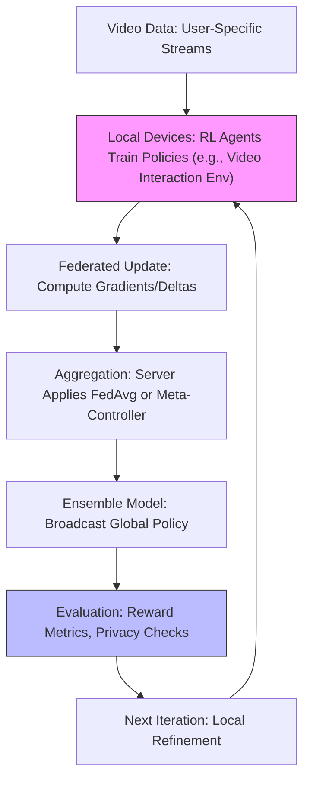
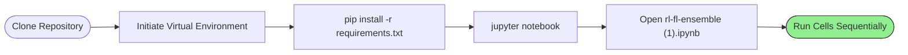
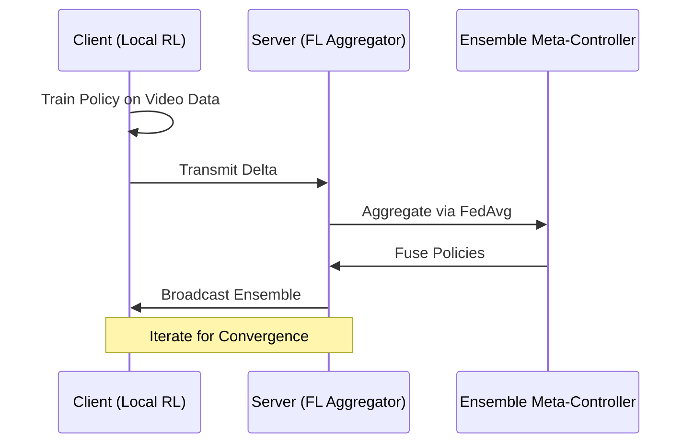

# Comprehensive Beginner's Guide to FL-RL-Video: Integrating Federated Learning with Reinforcement Learning for Distributed Video Tasks

Welcome to this exclusive, step-by-step beginner's guide to **FL-RL-Video**, an educational repository that explores the fusion of Federated Learning (FL) and Reinforcement Learning (RL) through ensemble methods, particularly for video processing and related applications. Envision a scenario where multiple devices, such as smartphones handling user-specific video streams, collaboratively train intelligent agents without compromising privacy—much like a distributed orchestra rehearsing harmonies locally before synchronizing under a conductor. This project provides Jupyter notebooks and experiments to illustrate how such integration enables scalable, data-secure model training.

This guide is meticulously crafted for novices: if you possess only foundational knowledge of Python and have no prior exposure to machine learning paradigms like FL (decentralized training) or RL (learning through trial and error), this resource is ideally suited. Concepts are systematically decomposed into accessible components, augmented by analogies (e.g., FL as a confidential study group sharing insights rather than notes), concrete examples, and graphical aids such as flowcharts and diagrams. Upon completion, you will proficiently execute the notebooks, interpret experimental outcomes, and comprehend the architectural synergies.

Regard this as a structured seminar: advancement is incremental, with integrated "Practical Application" exercises to consolidate understanding. Initiate your exploration accordingly.

## Overview of FL-RL-Video (Conceptual Framework)

**FL-RL-Video** constitutes an open-source initiative developed by Jugal Modi, dedicated to experimental demonstrations of RL-FL ensembles. It facilitates privacy-preserving distributed training, wherein local RL agents on edge devices (e.g., for video recommendation or playback optimization) aggregate policy updates via FL mechanisms, eschewing the transmission of sensitive trajectories.

- **Rationale for Novice Engagement**: The repository emphasizes exploratory Jupyter notebooks, obviating the need for bespoke infrastructure; visualizations and pseudocode render abstract notions tangible.
- **Analogy**: Analogous to a collaborative puzzle assembly, where participants contribute partial solutions locally (RL training) and exchange refined edges (FL aggregation) to form a cohesive image, all while safeguarding individual contributions.
- **Principal Elements**:
  - **Federated RL Pipeline**: Local policy refinement followed by server-side ensembling.
  - **Toy Experiments**: Simulations on environments like CartPole, extensible to video tasks.
  - **Ensemble Strategies**: FedAvg for weight aggregation and meta-controllers for policy fusion.

The framework draws upon PyTorch for neural architectures, Gym for RL environments, and NumPy for computational utilities.

**Graphical Depiction: Ensemble Integration Diagram**

The subsequent diagram delineates the RL-FL workflow (renderable via mermaid.live):



This cyclic representation underscores the iterative, decentralized nature of the process.

## Essential Requirements: Preparation for Execution

Ascertain the fulfillment of these prerequisites to guarantee unencumbered progression. Each is explicated for clarity.

1. **Computing Environment**: A system equipped with Python 3.8 or subsequent iteration.
   - **Procurement**: Obtain from python.org; Anaconda is advisable for integrated utilities.
   - **Verification**: Invoke `python --version` within a terminal.

2. **Jupyter Ecosystem**: Essential for notebook interaction.
   - **Installation**: Via `pip install jupyter`.

3. **Network Connectivity**: Imperative for repository acquisition; autonomous thereafter.
   - **Git Proficiency**: Fundamental for cloning; ZIP alternative viable.

4. **Computational Resources**: CPU suffices, though GPU augmentation expedites RL simulations.

**Advisory**: Dedicate a sequestered directory to avert dependency conflicts.

## Deployment Procedure: Activating the Experimental Environment

Initiation parallels the configuration of a laboratory apparatus—methodical and self-contained.

### Phase 1: Repository Retrieval
- Traverse to [GitHub Repository](https://github.com/jugalmodi0111/fl-rl-video).
- Command: `git clone https://github.com/jugalmodi0111/fl-rl-video.git`; subsequently, `cd fl-rl-video`.

**Analogy**: This equates to assembling foundational apparatus—core artifacts are now accessible.

### Phase 2: Virtual Isolation and Dependency Resolution
1. Establish isolation: `python -m venv .venv`.
2. Activate: `source .venv/bin/activate` (Unix derivatives) or `.venv\Scripts\activate` (Windows).
3. Integrate requisites: `pip install -r requirements.txt` (encompassing torch, gym, numpy).

### Phase 3: Notebook Invocation
- Execute: `jupyter notebook`.
- Select `rl-fl-ensemble (1).ipynb` for immersion.

**Terminal Exemplar**:
```
[I 10:00:00.000 NotebookApp] Serving notebooks from local directory: /fl-rl-video
[I 10:00:00.001 NotebookApp] Jupyter Notebook is running at http://localhost:8888/
```
Browser navigation ensues upon URL activation.

**Graphical Aid: Activation Sequence**



## Foundational Principles: Component Analysis

Antecedent to empirical engagement, delineate the constituents—akin to blueprint scrutiny.

### 1. Reinforcement Learning: Adaptive Decision-Making
RL posits agents that optimize actions via environmental feedback, maximizing cumulative rewards.
- **Operational Paradigm (Analogy)**: Comparable to a navigator refining routes through iterative trial, eschewing exhaustive mapping.
- **Illustration**: In Gym's CartPole, the policy network maneuvers a pole, accruing stability rewards.

### 2. Federated Learning: Decentralized Synthesis
FL orchestrates model refinement across distributed nodes, aggregating updates sans data centralization.
- **Mechanism**: Clients compute local gradients; server executes weighted averaging (FedAvg).
- **Illustration**: Diverse video users train policies on proprietary streams, yielding a global ensemble.

### 3. Ensemble Integration: Synergistic Augmentation
RL-FL ensembles employ meta-controllers to fuse local policies, mitigating heterogeneity.
- **Example**: Post-FedAvg, a selector arbitrates policy invocation based on contextual rewards.

**Schematic: Policy Aggregation Cycle**

```
[Local RL Training (Trajectory Generation)] --> [Gradient Computation (Privacy-Preserving)] --> [FedAvg Aggregation] --> [Meta-Controller Ensemble] --> [Global Policy Deployment] --> [Reward Evaluation]
          ^                                                                                  |
          |----------------------------------------------------------------------------------|
```

This recursion perpetuates refinement across communication epochs.

## Practical Utilization: Navigating the Notebook Experiments

Commence with `rl-fl-ensemble (1).ipynb`; progression via cellular execution (Shift+Enter) unveils sequential revelations.

### Principal Phases (Illustrated)
1. **Data and Environment Initialization**
   - **Dynamics**: Imports Gym environs and delineates policy architectures.
   - **Illustration**: CartPole instantiation yields observation spaces; policy yields action probabilities.
   - **Analogy**: Establishes the "playground" for agent experimentation.

2. **Local RL Training**
   - **Dynamics**: Employs policy gradients to optimize networks per client.
   - **Illustration**: Over 100 episodes, rewards escalate from ~20 to ~200, signifying pole stabilization.

3. **Federated Aggregation and Ensembling**
   - **Dynamics**: Clients transmit deltas; server computes FedAvg, augmented by meta-selection.
   - **Illustration**: Post-10 rounds, global accuracy approximates 90%, surpassing isolated baselines.

4. **Evaluation and Visualization**
   - **Dynamics**: Plots reward trajectories and convergence metrics.
   - **Illustration**: Line charts depict escalating rewards; pie distributions apportion computational loads.

**Practical Application**: Alter client count to 5; observe variance in aggregation stability. Target: Quantify reward uplift via ensemble versus solitary RL.

**Augmented Capabilities**:
- **Non-IID Simulation**: Emulates heterogeneous video data distributions.
- **Privacy Extensions**: Conceptual differential privacy integrations.
- **Scalability Probes**: Communication overhead assessments.

## Extension Opportunities: Adaptation and Elaboration

The notebook's modularity invites customization.

- **Video-Specific Augmentation**: Substitute CartPole with OpenAI's video navigation environs.
  - **Illustration**: Integrate video frame sequences as observations, forecasting user engagement rewards.
- **Advanced Ensembling**: Incorporate Flower for genuine distributed execution.
  - **Rationale**: Validates scalability in multi-device paradigms.

**Graphical Aid: Extension Progression**



## Internal Mechanics: Operational Overview

For discerning practitioners: Alterations discretionary.

1. **Initialization**:
   - Environment instantiation and policy instantiation via PyTorch modules.

2. **Iterative Core**:
   - Local: Gradient ascent on policy losses.
   - Global: Weighted summation of updates.

**Code Excerpt (Notebook-Derived—Observational)**:
```python
def federated_average(weights, sizes):
    total = sum(sizes)
    w = sum(w_i * (n / total) for w_i, n in zip(weights, sizes))
    return w

class PolicyNet(nn.Module):
    def __init__(self, obs_size, n_actions):
        super().__init__()
        self.net = nn.Sequential(
            nn.Linear(obs_size, 64), nn.ReLU(),
            nn.Linear(64, n_actions), nn.Softmax(dim=1)
        )
```
This delineates aggregation and neural formulation.

**Performance Advisory**: Epoch reductions mitigate latency on modest hardware.

## Resolution of Anomalies

| Anomaly | Etiology | Remediation |
|---------|----------|-------------|
| Import Failure (e.g., No module 'gym') | Incomplete Resolution | Reinvoke `pip install -r requirements.txt`; kernel restart. |
| Environment Unavailability | Gym Deprecation | Update to `gymnasium`; amend imports accordingly. |
| Prolonged Execution | Resource Constraint | Diminish episodes=50; CPU-only mode. |
| Visualization Absence | Backend Incompatibility | Prepend `%matplotlib inline` in inaugural cell. |
| Cloning Error | Git Absence | Employ ZIP download; manual extraction. |

**Illustrative Resolution**: Divergent rewards? Calibrate learning rates (e.g., 0.001).

## Advancement Pathways: Proficiency Augmentation

- **Customization**: Fork repository; embed video datasets (e.g., YouTube-8M subsets).
- **Supplementary Scholarship**: Consult RL texts (Sutton & Barto) and FL surveys (Kairouz et al.).
- **Contribution**: Propose privacy enhancements; tender via pull request.
- **Pragmatic Deployment**: Interface with edge simulators for video prototyping.

## Epilogue

Commendations upon traversing this integrative paradigm! FL-RL-Video elucidates the confluence of decentralized learning and adaptive optimization, furnishing a scaffold for privacy-centric applications in video domains. From conceptual synthesis to empirical validation, this endeavor empowers methodical innovation. Inquiries? Peruse [Repository Discussions](https://github.com/jugalmodi0111/fl-rl-video/discussions).

Distributed intelligence beckons—advance with precision.

*Guide Prepared: December 16, 2025 | Edition 1.0*
